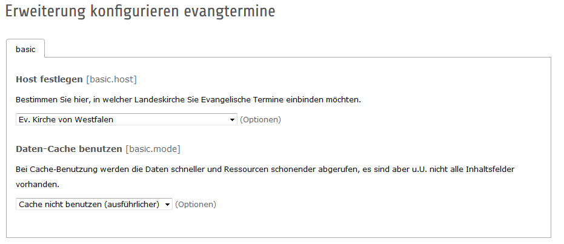
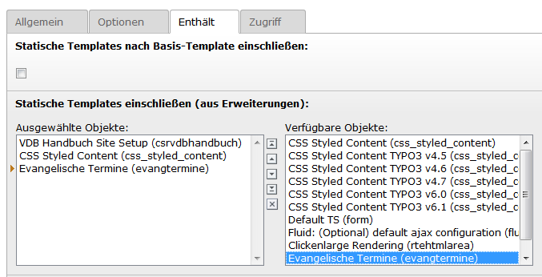

Installation
------------

Die Installation erfolgt wie üblich über den Erweiterungsmanager. Extension-Key: **evangtermine**

Auswahl Landeskirche und Cachemodus
^^^^^^^^^^^^^^^^^^^^^^^^^^^^^^^^^^^

Im Zug der Installation muss die Auswahl getroffen werden:

* In welcher Landeskirche die Extension eingesetzt wird
* Ob XML-Daten aus dem Cache von evangelische-termine.de geholt werden sollen

Wählen Sie dazu im Erweiterungsmanager unter "Erweiterungen verwalten" in der Liste die Extension evangtermine. 
Klicken Sie dann auf den Namen der Extension. 
 

	
	Auswahl der Landeskirche und des Cache-Modus per Dropdown-Menü

Speichern Sie die Auswahl.
	
	Tipp: Cache oder Direktabruf? Der Cache-Abruf ist schneller und schont Ressourcen des Webservers von evangelische-termine.de,
	der direkte Abruf belastet den Server mehr, ist inhaltlich aber ausführlicher bei der Anzeige einer einzelnen Veranstaltung. 
	Wenn möglich, sollte der Cache-Abruf verwendet werden.
	Hier hilft auch ausprobieren. Bei selbst erstellten Veranstaltungstypen kann es nötig sein, den Direktabruf zu verwenden. 

.. Tip:: In TYPO3 9.5 werden diese Einstellungen unter "Einstellungen" und dann "Extension Configuration" getätigt.

Aktivierung im TypoScript-Template
^^^^^^^^^^^^^^^^^^^^^^^^^^^^^^^^^^

Rufen Sie das TypoScript-Template der Wurzelebene Ihrer Website auf. Wählen Sie "Vollständigen Template-Datensatz bearbeiten".
Innerhalb des Reiters "Enthält" wählen Sie das statische TypoScript der evangtermine-Extension aus (s. Abbildung) und speichern die Auswahl.

	
	Aktivierung der Extension im TypoScript-Template

	