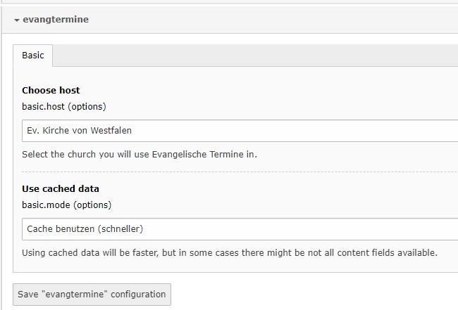
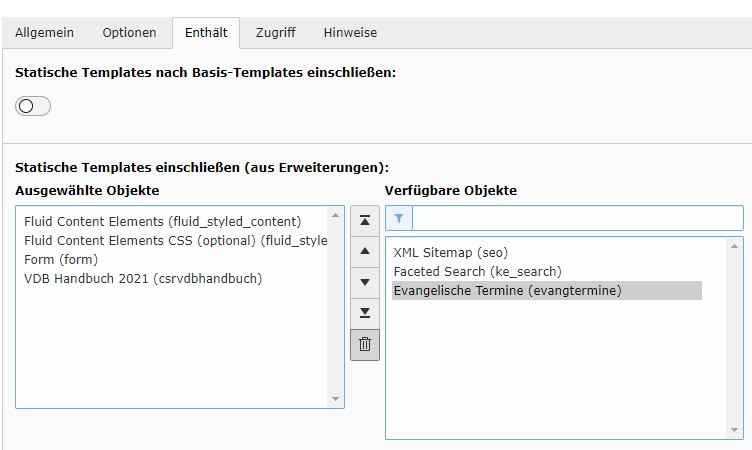

Installation
------------

Die Installation erfolgt entweder über composer: ```composer require arbkomekvw/evangtermine``` oder
über den Erweiterungsmanager. Extension-Key: **evangtermine**

Auswahl Landeskirche und Cachemodus
^^^^^^^^^^^^^^^^^^^^^^^^^^^^^^^^^^^

Im Zug der Installation muss die Auswahl getroffen werden:

* In welcher Landeskirche die Extension eingesetzt wird
* Ob XML-Daten aus dem Cache von evangelische-termine.de geholt werden sollen

Wählen Sie dazu im Erweiterungsmanager unter "Einstellungen -> Extension Configuration" in der Liste die Extension evangtermine. 
Klicken Sie dann auf den Namen der Extension. 
 

	
	Auswahl der Landeskirche und des Cache-Modus

Speichern Sie die Auswahl.
	
	Tipp: Cache oder Direktabruf? Der Cache-Abruf ist schneller und schont Ressourcen des Webservers von evangelische-termine.de,
	der direkte Abruf belastet den Server mehr, ist inhaltlich aber ausführlicher bei der Anzeige einer einzelnen Veranstaltung. 
	Wenn möglich, sollte der Cache-Abruf verwendet werden.
	Hier hilft auch ausprobieren. Bei selbst erstellten Veranstaltungstypen kann es nötig sein, den Direktabruf zu verwenden. 

Aktivierung im TypoScript-Template
^^^^^^^^^^^^^^^^^^^^^^^^^^^^^^^^^^

Rufen Sie das TypoScript-Template der Wurzelebene Ihrer Website auf. Wählen Sie "Vollständigen Template-Datensatz bearbeiten".
Innerhalb des Reiters "Enthält" wählen Sie das statische TypoScript der evangtermine-Extension aus (s. Abbildung) und speichern die Auswahl.


	
	Aktivierung der Extension im TypoScript-Template

	