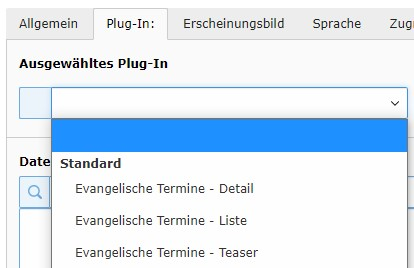

Einstellungen im Plugin
-----------------------

Fügen Sie zuerst im Backend das Plugin ein, z.B. über :menuselection:`Plugins --> Allgemeines Plug-In`.

	
	Auswahl des Plugins im Modus Detail, Liste oder Teaser

Anders als in früheren Versionen dieser Extension gibt es nun zuerst die Auswahl des gewünschten Verhaltens,
nämlich *Detail*, *Liste* oder *Teaser*

.. _sec-liste:

Liste
-----

Dies entspricht einer ausführlichen Veranstaltungsliste, wie sie aus den iframe-Ansichten und Skripten von
evangelische-termine.de bekannt ist.

Die Einstellungen verteilen sich über drei Reiter, die im Folgenden besprochen werden.

Reiter: Voreinstellung
~~~~~~~~~~~~~~~~~~~~~

In der Registerkarte "Voreinstellung" lassen sich bequem verschiedene Parameter setzen, die später
die Ausgabe bzw. Auswahl der Termine beeinflussen. Die Parameter selbst sind bei 
evangelische-termine.de dokumentiert [#]_

.. figure:: plugin_voreinstellungen.png
	:width: 600px
	:alt: Voreinstellungen der AusgabeParameter
	
	Voreinstellungen der AusgabeParameter
 
Im Einzelnen entsprechen sich:

===================== =========
Voreinstellung Plugin Parameter
===================== =========
Veranstalter-Id       vid
Highlights            highlight
Suchbegriff           q
Kategorie             eventtype
Zielgruppe            people
Termine pro Seite     itemsPerPage
===================== =========

Im Feld "Weitere Parameter" können Sie seltener benutzte Einstellungen vornehmen. Dazu ein Beispiel:
Es sollen nur Termine aus den Kanälen 35 und 41 (*cha*) im Jahr 2019 (*year*) angezeigt werden. Dazu tragen sie 
folgendes ein::

	cha=35,41&year=2019
	
Also durch das Zeichen '&' getrennte Paare aus Namen und Wert des Parameters, verbunden durch ein Gleichheitszeichen.

Reiter: Region
~~~~~~~~~~~~~~

In der Registerkarte "Region" stehen Voreinstellungen für die regionale Ausgabe. Es entsprechen sich:

======================= =========
Voreinstellung Plugin   Parameter
======================= =========
Region-ID               region
Gruppenadministrator-ID aid
======================= =========
 
.. _sec-liste-modus:

Reiter: Modus
~~~~~~~~~~~~~

Wenn Sie für die Ansicht der einzelnen Termine eine gesonderte Seite verwenden möchten, 
können Sie an dieser Stelle eine Seite für die Detailansicht auswählen. Diese Seite müssen Sie
zuvor angelegt haben und in der Seite muss das Plugin im Verhalten "Detail" vorhanden sein.

.. hint::
	Das Anlegen einer Seite für die Detailansicht ist optional. Wenn sie nicht existiert, werden die Veranstaltungsdetails auf der selben
	Seite gezeigt, auf der auch die Liste oder der Teaser steht. Beim Teaser wird es oft sinnvoll sein, eine Detailseite zu haben.

Teaser
------

Eine reduzierte Liste für die kurze Auflistung der nächsten Termine. Die Einstellungen entsprechen denen im vorangegangenen Abschnitt :ref:`Liste <sec-liste>`

Detail
------

Zeigt einen einzelnen Termin an. Nur sinnvoll, wenn die Seite, auf der das Plugin eingesetzt ist, als "Seite für Detailansicht" benutzt werden soll, s.o. 
beim Verhalten :ref:`Liste -> Reiter: Modus <sec-liste-modus>`

.. 	[#] https://handbuch.evangelische-termine.de/anzeige-im-internet/ausgabe-parameter.
	Die einzelnen Landeskirchen haben z.T. eigene Dokumente dazu im Netz. Für Westfalen existiert eine 
	angepasste Dokumentation unter https://handbuch.veranstaltungen-ekvw.de 