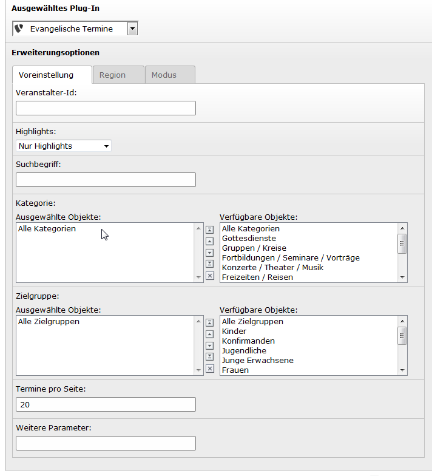
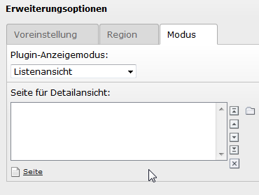

Einstellungen im Plugin
-----------------------

Die wesentlichen Einstellungen für das Verhalten des Plugins werden in der Backend-Ansicht des
Inhaltselements festgelegt.

Fügen Sie dazu im Backend auf der gewünschten Seite das Plugin ein, z.B. über 
:menuselection:`Plugins --> Allgemeines Plug-In --> Evangelische Termine`.

Die Einstellungen verteilen sich über drei Reiter, die im Folgenden besprochen werden.

Voreinstellung
^^^^^^^^^^^^^^

In der Registerkarte "Voreinstellung" lassen sich bequem verschiedene Parameter setzen, die später
die Ausgabe bzw. Auswahl der Termine beeinflussen. Die Parameter selbst sind bei 
evangelische-termine.de dokumentiert [#]_

	
	Voreinstellungen der AusgabeParameter
 
Im Einzelnen entsprechen sich:

===================== =========
Voreinstellung Plugin Parameter
===================== =========
Veranstalter-Id       vid
Highlights            highlight
Suchbegriff           q
Kategorie             eventtype
Zielgruppe            people
Termine pro Seite     itemsPerPage
===================== =========

Im Feld "Weitere Parameter" können Sie seltener benutzte Einstellungen vornehmen. Dazu ein Beispiel:
Es sollen nur Termine aus dem Kanal 35 (*cha*) im Jahr 2015 (*year*) angezeigt werden. Dazu tragen sie 
folgendes ein::

	cha=35, year=2015
	
Also durch Komma getrennte Paare aus Namen und Wert des Parameters, verbunden durch ein Gleichheitszeichen.

Region
^^^^^^

In der Registerkarte "Region" stehen Voreinstellungen für die regionale Ausgabe. Es entsprechen sich:

======================= =========
Voreinstellung Plugin   Parameter
======================= =========
Region-ID               region
Gruppenadministrator-ID aid
======================= =========
 

Modus
^^^^^

	
	Ansichts-Modus und Detailseite festlegen

Hier entscheiden Sie, in welchem Ansichts-Modus das Plugin betrieben werden soll. Drei Modi
stehen zur Auswahl:

1. Listenansicht
2. Teaser
3. Nur Detailansicht Termin

**Listenansicht:** Dies entspricht einer ausführlichen Veranstaltungsliste, wie sie aus den iframe-Ansichten und Skripten von
evangelische-termine.de bekannt ist.

**Teaser:** Eine reduzierte Liste für die kurze Auflistung der nächsten Termine 

**Nur Detailansicht Termin:** Wenn Sie für die Ansicht der einzelnen Termine eine gesonderte Seite verwenden möchten, 
können Sie auf dieser Seite das Plugin im Modus "Nur Detailansicht Termin" einbinden. Sie brauchen die anderen Parameter dann 
nicht auszufüllen. Auf der Seite mit der Liste der Termine müssen Sie dann unter "Seite für Detailansicht" die zuvor erwähnte gesonderte Seite
auswählen. 

	Tipp: Das Anlegen einer Seite für die Detailansicht ist optional. Wenn sie nicht existiert, werden die Veranstaltungsdetails auf der selben
	Seite gezeigt, auf der auch die Liste oder der Teaser steht. Beim Teaser wird es oft sinnvoll sein, eine Detailseite zu haben.

.. 	[#] http://handbuch.evangelische-termine.de/Ausgabe-Parameter.
	Die einzelnen Landeskirchen haben z.T. eigene Dokumente dazu im Netz. Für Westfalen existiert eine 
	angepasste Dokumentation unter http://handbuch.veranstaltungen-ekvw.de 