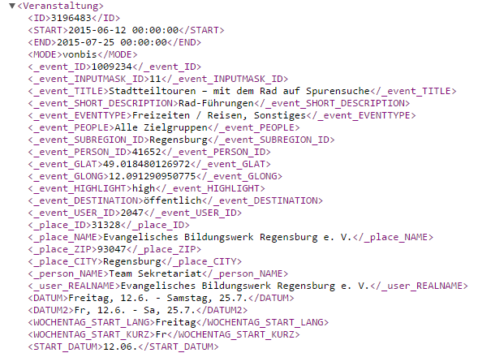

Persönliche Vorbemerkung
------------------------

Der Autor hat zwar in der Vergangenheit schon einige TYPO3-Extensions geschrieben, *evangtermine* ist jedoch die
erste mit dem (gar nicht mehr so) neuen Standard Extbase und Fluid. Das heißt, ich habe was die genannten Frameworks angeht, 
bei Null angefangen.

Wenn auch *evangtermine* funktionert (was ja das Minimum sein sollte), werden andere Entwickler schnell Stellen entdecken, 
an denen ich es nicht "richtig" oder framework-konform gemacht habe. Für konstruktive Kritik bin ich deshalb dankbar 
(christoph.roth@lka.ekvw.de).  

Feldwerte auslesen
------------------

evangtermine ruft die XML-Ausgabe von evangelische-termine.de ab, also z.B.::

	http://www.evangelische-termine.de/xml?highlight=high&itemsPerPage=20
	
Was zu einer XML-Datei mit einer Liste von <Veranstaltung>-Elementen führt (Ausschnitt):

	
	Ausschnitt XML-Ergebnis
	
Die Liste der <Veranstaltung>-Elemente wird in ein Array von SimpleXMLElement-Objekten übertragen und an das Fluid-Template
übergeben, es steht dort unter dem Namen **events.items** zur Verfügung. Im Template wird daraus eine Schleife gebildet::

	<f:for each="{events.items}" as="event">
	...
	...
	</f:for each>

Das heißt: Jedes **event** innerhalb der Schleife ist ein SimpleXMLElement-Objekt, auf dessen Feldwerte über deren Namen zugegriffen
werden kann, z.B.::

	event._user_REALNAME

So lassen sich alle Feldwerte auslesen.

Labels
^^^^^^

Wenn auf die Labels einzelner Felder zugegriffen werden soll, steht dafür ein eigener ViewHelper zur Verfügung, z.B.::

	<et:attr on="{event._event_TITLE}" name="Label" />
	
Liest aus dem Objekt unter event._event_TITLE das Attribut "Label", also in diesem Fall der Wert "Titel".
	

Verwendbare ViewHelper
----------------------

**et:attr**
	
Liest Attributwerte aus einem SimpleXMLElement-Objekt aus::
	
	<et:attr on="{event._event_TITLE}" name="Label" />
	
ergibt "Titel".	
	
============ =============================== =======
Eigenschaft  Bedeutung                       Pflicht
============ =============================== =======
on           SimpleXMLElement-Objekt         ja
name         Name des zu lesenden Attributs  ja
============ =============================== =======

**et:etpager**

Stellt ein Element zum Blättern durch die Liste der Termine dar::
	
	<et:etpager totalItems="{events.metaData.totalItems}" itemsPerPage="{etkeys.itemsPerPage}" currentPage="{etkeys.pageID}"/>
		
============ ============================== =======
Eigenschaft  Bedeutung                      Pflicht
============ ============================== =======
totalItems   Menge aller gefundenen Events  ja
itemsPerPage Events pro Seite               ja
currentPage  Nummer (pageID) aktuelle Seite ja
============ ============================== =======

**et:str**

Liefert den Inhalt eines SimpleXMLElement-Objekts als String [*]_. Verwendet nur innerhalb von condition-Eigenschaften
des f:if-View Helpers::

	<f:if condition="<et:str on='{event._event_TEXTLINE_2}'/>">

============ ============================== =======
Eigenschaft  Bedeutung                      Pflicht
============ ============================== =======
on           SimpleXMLElement-Objekt        ja
============ ============================== =======
	
	
**et:tag**

Hüllt den Wert von *node* in einen Tag *name* mit einem class-Attribut *class*::

	<et:tag node="{event._event_TITLE}" name="p" class="important" />
	
	erzeugt
	
	
Gottesdienst zum Erntedank

	
Werden *name* und *class* nicht angegeben, entspricht *name* = "span" und *class* dem Namen des
XML-Knotens mit vorangestelltem "et", also z.B. *et_event_TITLE* 

=========== ============================== =======
Eigenschaft Bedeutung                      Pflicht
=========== ============================== =======
node        SimpleXMLElement-Objekt        ja
name        Tag-Name, z.B.: div, p         nein
class       Class-Name                     nein
=========== ============================== =======

Fluid-Templates: Verwendbare Daten
----------------------------------

Template: **List.html** (EventcontainerController, Action: **list**)
^^^^^^^^^^^^^^^^^^^^^^^^^^^^^^^^^^^^^^^^^^^^^^^^^^^^^^^^^^^^^^^^^^^^

**events**
	Objekt vom Typ Eventcontainer, enthält unter {events.items} die Liste der <Veranstaltung>-Elemente
	(SimpleXMLElements) und unter {events.metaData} das Element <meta>.
	
**etkeys**
	Objekt vom Typ EtKeys. Attribute des Objekts sind alle aktiven Request-Parameter aus dem Abruf
	der XML-Daten. {etkeys.highlight} liefert z.B. den Parameter *highlight* mit dem Wert *high* oder *all*, 
	{etkeys.vid} die aktive Veranstalter-Id usw.   

Template: **Teaser.html** (EventcontainerController, Action: **teaser**)
^^^^^^^^^^^^^^^^^^^^^^^^^^^^^^^^^^^^^^^^^^^^^^^^^^^^^^^^^^^^^^^^^^^^^^^^

**events**
	Objekt vom Typ Eventcontainer, wie oben beim Template List.hmtl.

Template: **Show.html** (EventcontainerController, Action: **show**)
^^^^^^^^^^^^^^^^^^^^^^^^^^^^^^^^^^^^^^^^^^^^^^^^^^^^^^^^^^^^^^^^^^^^

**event**
	Alle Felder der Einzelveranstaltung, die angezeigt werden soll, z.B. {event._place_NAME} für den Veranstaltungsort.

**detailitems**
	Die Felder des Elements <detail>, das ist eine Liste von <item>-Elementen mit fertig zusammengesetzter
	Veranstaltungsadresse und anderen Informationen.
	

**eventhost**
	Der Hostname, der im Extension Manager eingestellt wurde, z.B. www.evangelische-termine.de oder www.veranstaltungen-ekvw.de

.. [*] Dieser ViewHelper ist eine Notlösung, weil z.B. folgendes nicht funktioniert::

           <f:if condition="{event._event_TEXTLINE_2}">
           
       Es muss an den Interna des SimpleXMLElement liegen. Leider ist diese Lösung (Tipp-) fehleranfällig und umständlich.

 